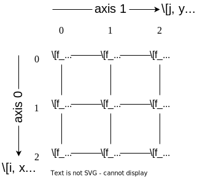

# Derivative Operation

## Finite Difference

The finite difference is a simple way to calculate the derivative of a function $f(x)$.
There are three different ways of calculation scheme: forward, backward and central difference.
Each of them is defined as follows:

$$
\begin{align}
f'_i &= \frac{f_{i+1} - f_i}{h} \quad \mathrm{forward} \\
f'_i &= \frac{f_i - f_{i-1}}{h} \quad \mathrm{backward} \\
f'_i &= \frac{f_{i+1} - f_{i-1}}{2h} \quad \mathrm{central}
\end{align}
$$

where $f_i \equiv f(x_i)$, $f'_i \equiv df/dx|_{x=x_i}$ and $h \equiv x_i - x_{i-1}$ is the step
size between adjacent grid points $x_i$ and $x_{i-1}$. The grid points are assumed to be equally
spaced.

## 1-D Derivative Matrix

Let us compute the derivative matrix by considering $f'_i$ for $i=0, 1, 2$.
If using the forward difference, we have the following equations:

$$
\begin{bmatrix}
    f'_0 \\
    f'_1 \\
    f'_2
\end{bmatrix}
&=
\frac{1}{h}
\begin{bmatrix}
    f_1 - f_0 \\
    f_2 - f_1 \\
    0 - f_2
\end{bmatrix}\\
&=
\frac{1}{h}
\begin{bmatrix}
    -1 & 1 & 0 \\
    0 & -1 & 1 \\
    0 & 0 & -1
\end{bmatrix}
\begin{bmatrix}
    f_0 \\
    f_1 \\
    f_2
\end{bmatrix},
$$

where we regarded out-of-boundary values as zero (dirichlet boundary condition).

Similarly, we can obtain the derivative matrix for the backward difference:

# $$\begin{bmatrix}f'_0 \\f'_1 \\f'_2\end{bmatrix}

\frac{1}{h}
\begin{bmatrix}
1 & 0 & 0 \\
-1 & 1 & 0 \\
0 & -1 & 1
\end{bmatrix}
\begin{bmatrix}
f_0 \\
f_1 \\
f_2
\end{bmatrix}.
$$

These two matrices are called **derivative matrices**.

If we consider the second derivative, we have the following numerical approximation:

$$
f''_i
= \frac{\frac{f_{i+1} - f_{i}}{h} - \frac{f_i - f_{i-1}}{h}}{h}
= \frac{f_{i+1} - 2f_i + f_{i-1}}{h^2}.
$$

(second-derivative)

Then, the second derivative matrix with $i=0, 1, 2, 3$ is given by

# $$\begin{bmatrix}f_0'' \\f_1'' \\f_2'' \\f_3''\end{bmatrix}

\frac{1}{h^2}
\begin{bmatrix}
-2 & 1 & 0 & 0 \\
1 & -2 & 1 & 0 \\
0 & 1 & -2 & 1 \\
0 & 0 & 1 & -2
\end{bmatrix}
\begin{bmatrix}
f_0 \\
f_1 \\
f_2 \\
f_3
\end{bmatrix}.
$$

In this case, the second derivative is expressed by the tridiagonal matrix: $\mathrm{tridiag}(1, -2, 1)/h^2$.

## 2-D Derivative Matrix

If we consider 2-D function $f(x, y)$ like images, we can calculate the derivative matrix in $x$ and
$y$ directions separately.

Let us consider only 9 grid points for simplicity, each of which is denoted by $f_{i,j}$ for
$i, j = 0, 1, 2$, where $i$ and $j$ are indices for $x$ and $y$ directions, respectively.

The grid configuration looks like the following:

:::{figure-md}
{align="center"}

The example $3\times 3$ grid of images.
:::

When applying the derivative matrix to an image, we need to flatten the image to a 1-D
vector:

$$
\begin{bmatrix}
f_{0, 0} & f_{0, 1} & f_{0, 2} & f_{1, 0} & f_{1, 1} & f_{1, 2} & f_{2, 0} & f_{2, 1} & f_{2, 2}
\end{bmatrix}^\mathsf{T}.
$$

So, the derivative matrix $\mathbf{D}_y^{(\mathrm{f})}$ along $y$ direction using the forward scheme can be
expressed as follows:

# $$\mathbf{D}_y^{(\mathrm{f})}

\frac{1}{h_y}
\begin{bmatrix}
-1 & 1 & & & & & & & \\
& -1 & 1 & & & & & & \\
& & -1 & 0 & & & & & \\
& & & -1 & 1 & & & & \\
& & & & -1 & 1 & & & \\
& & & & & -1 & 0 & & \\
& & & & & & -1 & 1 & \\
& & & & & & & -1 & 1 \\
& & & & & & & & -1
\end{bmatrix},
$$

where $h_y$ is the step size along $y$ direction.

We can see that some elements next to the diagonal ones are zero.
This is because the derivative at rightmost column is not related to one at the next grid point
(leftmost column).
Additionally, we assumed the dirichlet boundary condition outside the grid and set the values to
zero, i.e. $f_{i, 2}' = (0 - f_{i, 2})/h$ for $i=0, 1, 2$.

## Laplacian Matrix

The laplacian operation to a 2-D function $f(x, y)$ is defined as follows and approximated by
the finite difference:

$$

&\nabla^2 f = \frac{\partial^2 f}{\partial x^2} + \frac{\partial^2 f}{\partial y^2},\\
&\nabla^2 f_{i,j} = \frac{f_{i+1, j} - 2f_{i, j} + f_{i-1, j}}{h_x^2} + \frac{f_{i, j+1} - 2f_{i, j} + f_{i, j-1}}{h_y^2},\\

$$

where $h_x$ and $h_y$ are the step sizes along $x$ and $y$ directions, respectively.

The finite laplacian formula can be seen as the sum of the second derivative
{eq}`second-derivative` along $x$ and $y$ directions.

This means that the **laplacian matrix** $\mathbf{L}$ can be obtained by adding the second
derivative matrices along each direction, that is:

$$
\mathbf{L} \equiv \frac{\mathbf{D}_x^{(f)} - \mathbf{D}_x^{(b)}}{h_x} + \frac{\mathbf{D}_y^{(f)} - \mathbf{D}_y^{(b)}}{h_y},
$$

where $\mathbf{D}_\alpha^{(f)}$ and $\mathbf{D}_\alpha^{(b)}$ are the derivative matrices along
$\alpha$ direction using the forward and backward schemes, respectively.

Moreover, considering the second derivative along the diagonal direction (i.e. $f_{i+1, j+1}$ and
$f_{i-1, j-1}$ and $f_{i+1, j-1}$ and $f_{i-1, j+1}$), we can obtain the another laplacian matrix.
In this case the step size along such diagonal direction is $\sqrt{h_x^2 + h_y^2}$.

## Example and Implementation

The functionalities to calculate the derivative and laplacian matrices are implemented in `cherab.inversion.tools` module.

The example calculation can be found in [a notebook](../notebooks/others/derivative_operator).
